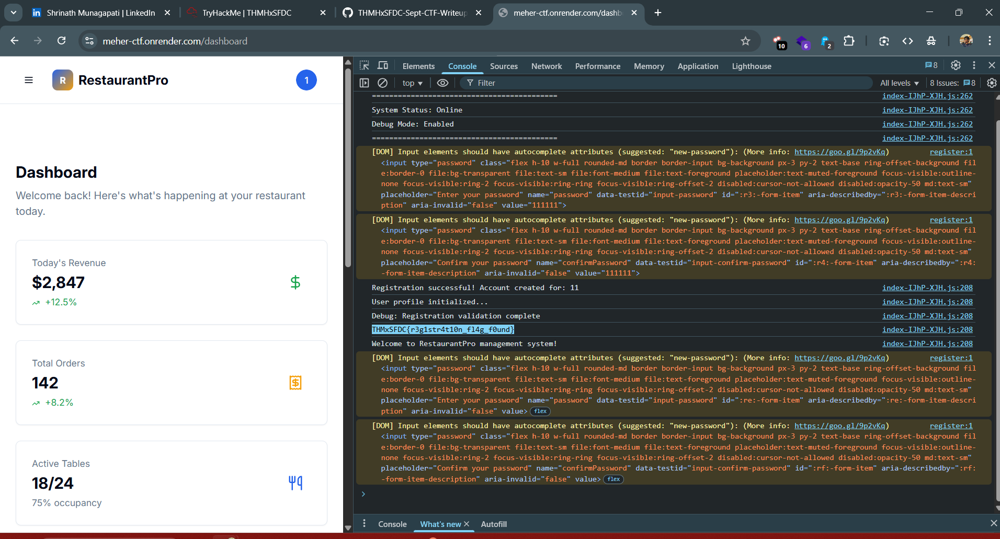

# CTF Write-Up: Task 1.1 | Kitchen Note
## Difficulty: Easy | Points: 20

## 📂 Task Details
- **Target Site:** [meher-ctf.onrender.com](https://meher-ctf.onrender.com/)  
- **Flag Format:** `THMxSFDC{....}`  

---

## ❓ Challenge Story
While setting up the online restaurant portal, the Chef left behind a note tucked away in the system logs. It was just a half-written reminder about an old pantry folder, never meant for diners to notice. Anyone curious enough to peek might find the first clue hidden there.

---

## 🔍 Approach & Analysis

1. **Accessing the Target Site**  
   - Opened the Target site. 
   - Landed on a **login page**, but no credentials were provided.

2. **Creating a New Account**  
   - Clicked the **Sign Up** option to register a new account.  
   - Filled in the required details and successfully created an account.  

3. **Inspecting the Page**  
   - Logged in with the newly created account.  
   - Opened the **browser developer console** (`F12`) to inspect scripts and logs.  
   - And there it was, printed in the console.

---

## ✅ Flag
    THMxSFDC{r3g1str4t10n_fl4g_f0und}