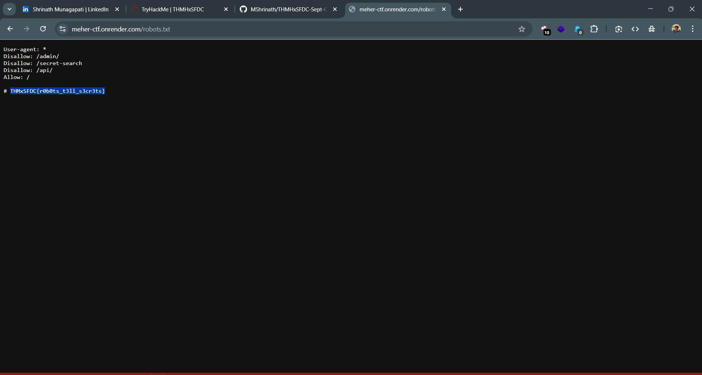

# CTF Write-Up: Task 1.2 | Forbidden Pantry
## Difficulty: Easy | Points: 20

## 📂 Task Details
- **Target Site:** [meher-ctf.onrender.com](https://meher-ctf.onrender.com/)  
- **Flag Format:** `THMxSFDC{....}`

---

## ❓ Challenge Story
The janitor once stumbled across the Chef’s private recipe book while navigating the staff portal. Not knowing its value, he marked the folder as restricted in the system’s back-end. That careless note still lingers, quietly hinting toward a forgotten archive.

---

## 🔍 Approach & Analysis

1. **Understanding the Story Clues**  
   - The story mentioned a **“restricted folder”** and a forgotten archive.  
   - This hinted that the content might be hidden but still accessible somehow.

2. **Checking Site Metadata**  
   - Remembered that some hidden paths are often listed in `robots.txt`.  
   - Opened `/robots.txt` and found the flag waiting there.

---

## ✅ Flag
    THMxSFDC{r0b0ts_t3ll_s3cr3ts}