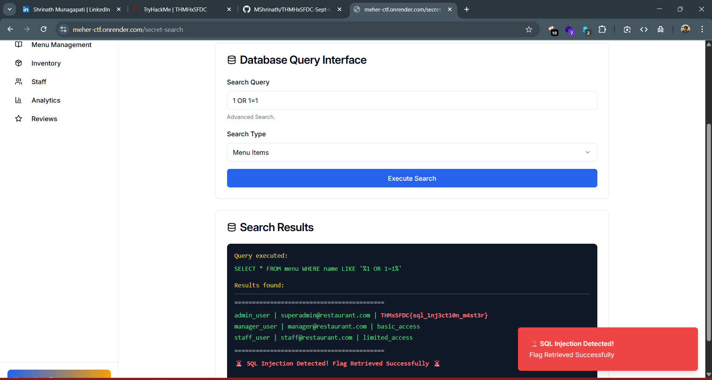

# CTF Write-Up: Task 1.3 | Archivist’s Ledger
## Difficulty: Easy | Points: 30

## 📂 Task Details
- **Target Site:** [meher-ctf.onrender.com](https://meher-ctf.onrender.com/)  
- **Flag Format:** `THMxSFDC{....}`

---

## ❓ Challenge Story
Buried deep within the portal is the Archivist’s ledger, a digital record of recipes and notes that staff thought were long forgotten. It was meant only for the Chef and his closest aides. Yet the ledger is not guarded carefully. With the right kind of request, it reveals more than it should, including another fragment of the Chef’s secret book.

---

## 🔍 Approach & Analysis

1. **Observing the Story Clues**  
   - The story mentions a **portal** that holds the Archivist’s ledger.  
   - This hinted at a hidden interface or section in the site.

2. **Exploring Known Paths**  
   - As seen in the previous subtask, the `robots.txt` file listed hidden paths.  
   - Noticed a `/secret-search` path which led to a **Database Query Interface**.

3. **Testing for SQL Injection**  
   - Tried basic SQL injection payloads to see if queries could be manipulated.  
   - Successfully used `1 OR 1=1` and retrieved the contents of the ledger, which contained the flag.

---

## ✅ Flag
    THMxSFDC{sql_1nj3ct10n_m4st3r}