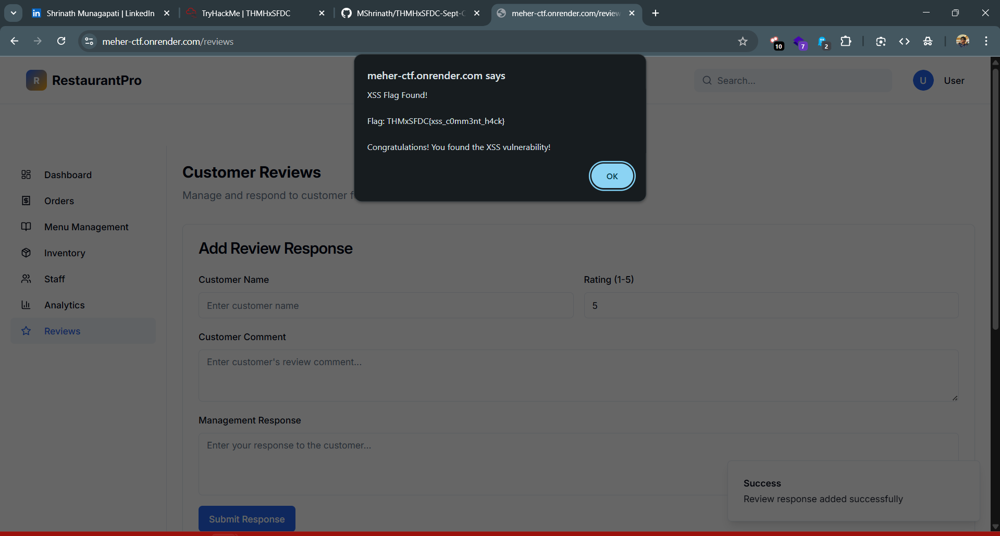

# CTF Write-Up: Task 1.4 | Reflections of the Crowd
## Difficulty: Medium | Points: 20

## 📂 Task Details
- **Target Site:** [meher-ctf.onrender.com](https://meher-ctf.onrender.com/)  
- **Flag Format:** `THMxSFDC{....}`

---

## ❓ Challenge Story
Secrets do not always hide in logs and ledgers. Sometimes they slip through the voices of customers. The portal proudly echoes whatever is spoken, yet it does so without care. Clever diners have noticed that when reflections are repeated without question, even a casual remark can twist into something dangerous. In that distortion, another secret of Chef’s book is exposed.

---

## 🔍 Approach & Analysis

1. **Following the Story Clues**  
   - The story talks about the **“voice of customers”** and echoes, hinting at user-submitted content.  
   - Checked the **dashboard**, found a **reviews page** where diners could submit input.

2. **Testing for XSS**  
   - The input was not sanitized, so tried a simple XSS payload:  
     ```html
     <script>alert(1)</script>
     ```  
   - It successfully executed, confirming a **Reflected XSS vulnerability**.  
   - The page revealed the flag in the process.



---

## ✅ Flag
    THMxSFDC{xss_c0mm3nt_h4ck}