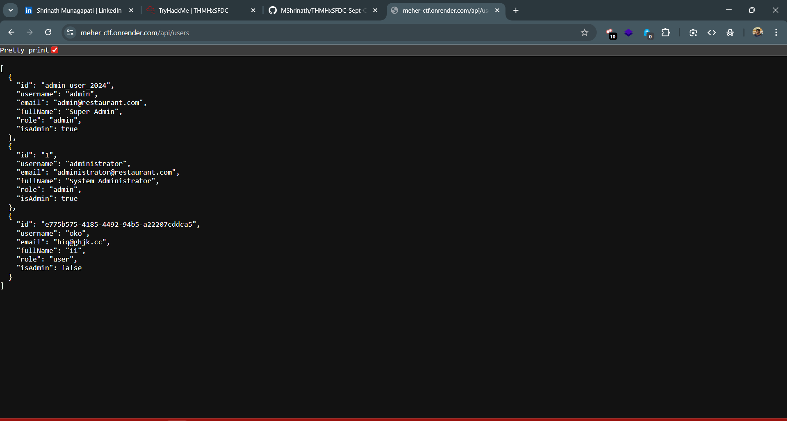
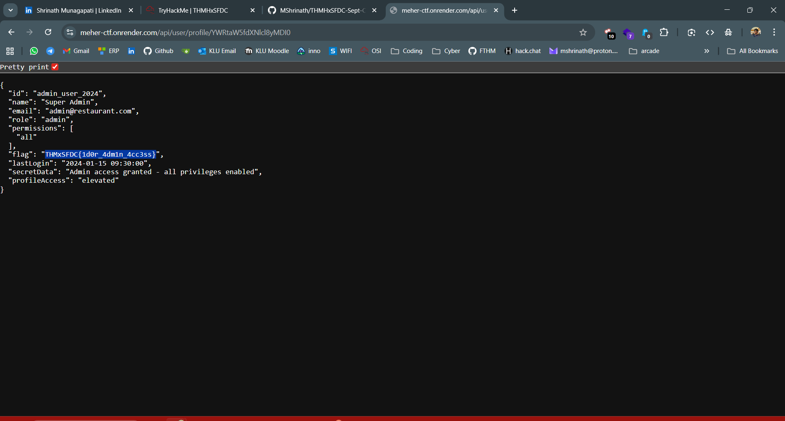

# CTF Write-Up: Task 1.5 | The Hidden Pantry Ledger
## Difficulty: Medium | Points: 50

## 📂 Task Details
- **Target Site:** [meher-ctf.onrender.com](https://meher-ctf.onrender.com/)  
- **Flag Format:** `THMxSFDC{....}`

---

## ❓ Challenge Story
Behind the scenes of the portal lies a private ledger, a section meant only for trusted staff accounts. The locks on its digital shelves are weaker than they appear. A determined user who tampers with the right identifier can bypass the restriction and stumble upon records that were never meant for their eyes. Hidden among them lies yet another piece of the Chef’s secret book.

---

## 🔍 Approach & Analysis

1. **Following the Story Clues**  
   - The story mentioned a “private ledger” for trusted staff accounts, hinting at an **admin-only section**.  
   - Checked `robots.txt` and noticed a `/admin` path, likely where the private records are hidden.

2. **Exploring the Admin Panel**  
   - Navigated to `/admin` and found a **panel listing all users**.  
   - Opened the **network tab** and saw an API call:  
     ```
     /api/users
     ```  
     Returning a JSON of all users, their IDs, and admin status — exactly the information the story hinted we could uncover.



3. **Accessing the Ledger**  
   - From the JS source code, found an endpoint:  
     ```
     /api/user/profile/{id}
     ```  
     Each ID needed to be **Base64 encoded**.  
   - Tried the IDs from `/api/users` after encoding them, and the API returned the corresponding user details.

4. **Finding the Flag**  
   - Among the returned user data there was the **flag**, completing the final piece of the Chef’s secret book.



---

## ✅ Flag
    THMxSFDC{1d0r_4dm1n_4cc3ss}