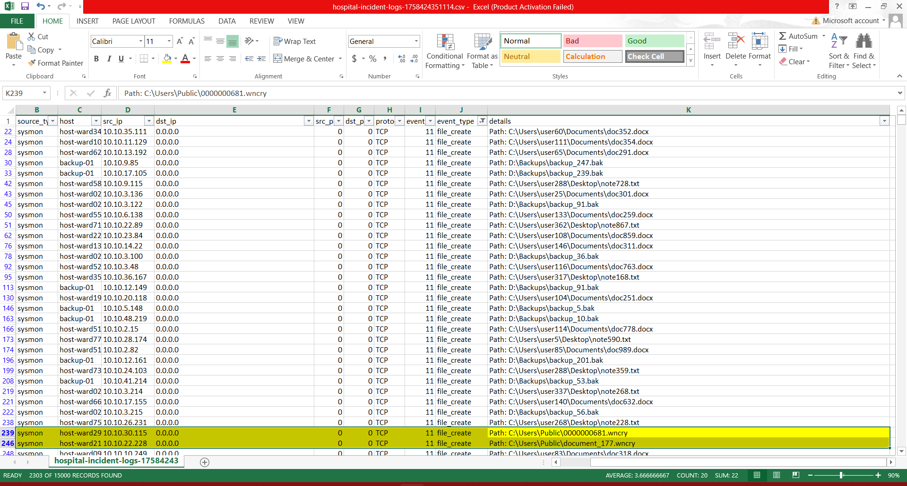

# CTF Write-Up: Task 2  
# CTI: Hospital Outbreak | **Points:** 50

## 📂 Task File  
[Hospital Logs CSV](src\hospital-incident-logs-1758424351114.csv)

---

## ❓ Question

**Which threat actor was responsible for this incident?**

---

## 🔍 Approach & Analysis

1. **Initial Exploration**  
   - Opened the CSV in a spreadsheet editor.
   - Examined the columns and rows to understand the types of events recorded.

2. **Focusing on Suspicious Events**  
   - Filtered the `event_type` column for `file_create` events.  
   - Noticed multiple files being created with the **`.wncry` extension**.

   <!-- 📸 Place a screenshot here showing the filtered CSV or relevant file_create events -->
   

3. **Connecting the Dots**  
   - `.wncry` is a known indicator of **WannaCry ransomware**.  
   - Quick research confirmed that WannaCry is attributed to the threat actor **Lazarus**.

---

## ✅ Flag

> **lazarus**  

