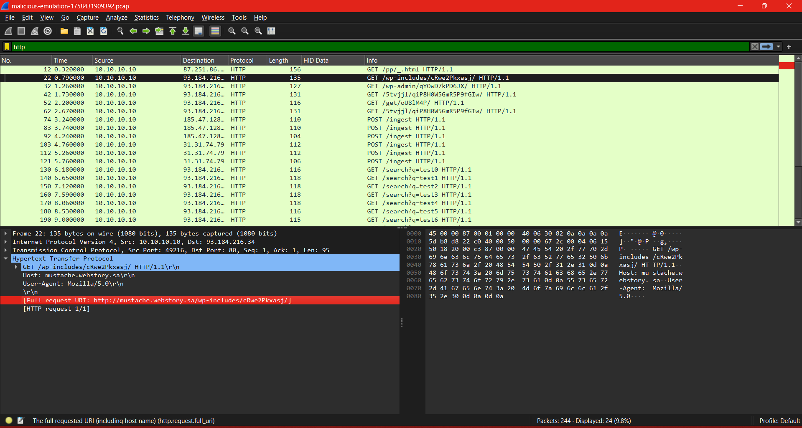
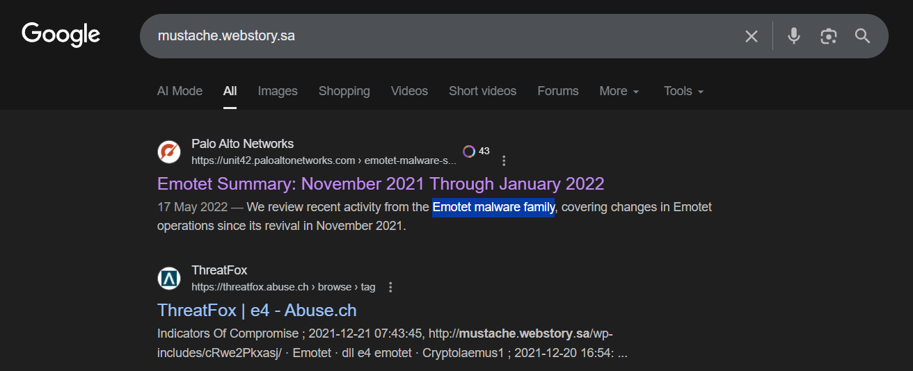

# CTF Write-Up: Task 3  
# CTI: Silent Fetch | Points: 50

## 📂 Task File  
[PCAP file](src/malicious-emulation-1758431909392.pcap)

*Analyse the (`.pcap`) and answer the question.*

---

## ❓ Question

**Which threat actor was responsible for the activity observed in the provided PCAP?**

---

## 🔍 Approach & Analysis

1. **Initial Exploration**  
   - Opened the PCAP file in **Wireshark**.  
   - Browsed through HTTP and DNS traffic to identify unusual requests.  

2. **Identifying Suspicious Traffic**  
   - Found repeated attempts to access a domain:  
     ```
     mustache.webstory.sa
     ```  
   - The traffic showed requests to `/wp-admin`, which looked suspicious.  

   

3. **Domain Investigation**  
   - Tried to access the domain in a browser, but it was inactive.  
   - Performed an open-source search for `mustache.webstory.sa`.  

   

4. **Threat Intelligence Correlation**  
   - Found threat intel reports and documentaries linking this domain to **Emotet malware campaigns**.  
   - Concluded that the activity in the PCAP was related to the **Emotet threat actor**.  

---

## ✅ Flag

    emotet