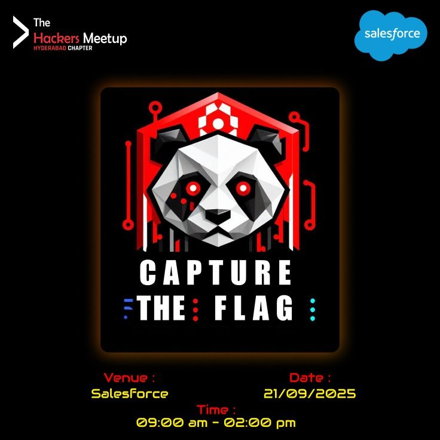

# THMHxSFDC SEPT CTF Writeup 🕵️‍♂️

  

---

## 🏆 Challenges

| Task   | Challenge | Objective | Points |
|--------|------------|-----------|--------|
| 1 | [Web Exploitation](CTF_Writeups/Task1.md) | Analyze a web link and exploit it | 140 |
| 2 | [CTI: Hospital Outbreak](CTF_Writeups/Task2.md) | Analyze a CSV to identify the threat actor | 50 |
| 3 | [CTI: Silent Fetch](CTF_Writeups/Task3.md) | Analyze a PCAP file to find the threat actor | 50 |

---

## 🔗 Connect

|  My LinkedIn |  THM Hyd Linktree |
|:------------------------------------------------------------:|:------------------------------------------------------------:|

